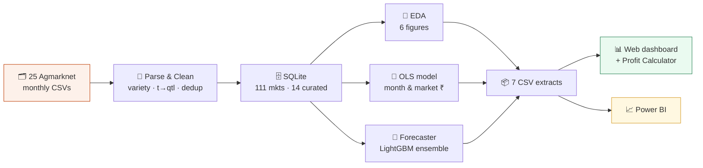

<!-- ══════════════════════  HEADER  ══════════════════════ -->
<div align="center">


<a href="https://git.io/typing-svg">
  
</a>

<br/>


-informational?style=flat-square)

### 🔗 Quick links — open the deliverables

**🌐 [Open the Web Dashboard (live)](https://htmlpreview.github.io/?https://github.com/kakulgarg/mangos-/blob/main/dashboard/mandi_dashboard.html)**  ·  **📊 [Power BI Dashboard (.pbix)](dashboard/MANGOS-dashboard.pbix)**  ·  **🎥 [Walkthrough Video](PASTE_YOUR_VIDEO_LINK_HERE)**

**📑 [Slide Deck](presentation/DeHaat_Mandi_Price_Watch_Team_Mangos.pptx)**  ·  **📝 [Decision Memo (PDF)](memo/decision_memo.pdf)**  ·  **📖 [Full Documentation](DOCUMENTATION.md)**

<sub>ℹ️ Paste your recorded **video link** over `PASTE_YOUR_VIDEO_LINK_HERE` before final submission.</sub>

</div>

<!-- ══════════════════════  INTRO  ══════════════════════ -->

## 🧅 What is this?

**Onion Market Intelligence** turns **31,930 real onion-price records** from
**111 Maharashtra markets** (Jun 2024 – Jun 2026, [Agmarknet](https://agmarknet.gov.in))
into clear, money-focused answers a farmer or field agent can act on:

> **When** to sell · **Where** to sell · **Which** variety pays most · **What** next month's price will be · and — after transport & costs — **which mandi actually leaves the most money.**

Everything is **reproducible** (one command rebuilds it all in ~20 s), **tested**,
and shown in an **interactive dashboard**.

<div align="center">



</div>

---

## ✨ Highlights

- 🗓️ **Seasonal timing engine** — finds the best months to sell (worth ₹1,503/qtl).
- 📍 **Market comparison** — ranks 14 curated mandis by price.
- 🧅 **Variety analysis** — Red vs Local vs White vs Unhali.
- 🔮 **Next-month forecaster** — LightGBM + persistence ensemble with a prediction interval.
- 🧮 **Profit Calculator** — enter location, quantity & variety → get the mandi with the **highest take-home profit** after transport, commission & labour.
- ✅ **Honest by design** — reports where the model is weak, not just where it shines.
- ⚙️ **One-command, reproducible pipeline** + **9 automated tests**.

---

## 🎯 The answers (from real data)

| Lever | Finding | Worth to the farmer |
|:--|:--|:--|
| 🗓️ **When** | Peak **Nov** vs trough **May** | **₹1,503 / quintal** (≈ 2.5×) |
| 📍 **Where** | **Lasalgaon / Nashik belt** vs Chh. Sambhajinagar | **₹756 / quintal** (gross) |
| 🧅 **Which** | **Red onion** vs Local | **₹530 / quintal** (+31%) |
| 🔮 **Next month** | Forecast for **Jul 2026**: Pimpalgaon Baswant | **₹1,788/qtl** (range ₹1,555–1,884) |

Prices **peak in September–November** and **trough in April–May** — the seasonal
shape is shared across markets; only the price *level* differs.

---

## 🧮 The core idea — maximum profit, not just maximum price

The key insight: **the highest price is not the highest profit.** A far mandi may
show a higher price, but after transport a closer one can leave more money. So the
Profit Calculator computes, for **every** mandi:

```
Take-home  =  price × quantity
              − transport   (distance × rate)
              − commission  (% of sale)
              − labour
```

…then ranks the markets by take-home and recommends the winner — with a live
cost-breakdown and an uncertainty note. It knows each mandi's coordinates, so it
turns the farmer's **location** into distances automatically.

---

## 🚀 Quickstart

```bash
# 1) set up
python -m venv .venv
.venv\Scripts\activate            # Windows   (Mac/Linux: source .venv/bin/activate)
python -m pip install --upgrade pip
pip install -r requirements.txt

# 2) run the whole pipeline (~20 seconds)
cd src
python run_pipeline.py

# 3) (optional) run the tests
python -m pytest ../tests -q       # → 9 passed

# 4) open the dashboard
#    double-click  dashboard/mandi_dashboard.html
```

> 💡 The pipeline regenerates **every** figure, table, and both dashboards from the
> raw data. Drop new monthly exports into `data/01_source/` and re-run to refresh.

<details>
<summary><b>▶ Run steps individually</b></summary>

```bash
# from src/
python parse_agmarknet.py     # parse raw exports
python load_db.py             # load into SQLite
python clean.py               # clean + feature engineer
python run_sql.py             # 7 analytical SQL queries
python eda.py                 # exploration figures
python model.py               # explanatory model (month/market ₹)
python forecast.py            # next-month forecaster
python build_extracts.py      # dashboard CSVs
python build_dashboard_html.py# interactive web dashboard
python run_pipeline.py --from forecast   # resume from a step
```
</details>

---

## 🛠️ Tech stack

| Layer | Tools |
|:--|:--|
| **Language** | Python 3.10–3.13 |
| **Data** | pandas · NumPy · SQLite / SQL |
| **Statistics** | statsmodels (OLS, HAC robust SEs) |
| **Machine learning** | LightGBM · scikit-learn |
| **Charts / reports** | Matplotlib · ReportLab (PDF) |
| **Web dashboard** | HTML · CSS · JavaScript · Chart.js |
| **BI** | Power BI (same 7 CSV extracts) |
| **Quality** | pytest · Git · logging · pinned deps |

---

## 📂 Repository structure

```
DeHaat_Mandi_Price_Watch/
├── data/  01_source → 02_interim → 03_processed   # raw → parsed → cleaned + DB
├── sql/   schema.sql · analysis.sql (7 queries incl. variety)
├── src/   parse → load → clean → sql → eda → model → forecast → extracts → dashboard
│          run_pipeline.py  (one command runs it all)
├── tests/ pytest suite (parser · cleaning · forecaster leakage)
├── notebooks/  reconciliation log · data-quality note · feature spec · model card
├── outputs/    query results · 12 figures · model + forecast artefacts
├── dashboard/  7 CSV extracts · mandi_dashboard.html · Power BI guide + theme
├── memo/       one-page decision memo (MD + PDF)
├── ai_appendix/ AI workflow appendix
├── README.md · DOCUMENTATION.md · requirements.txt
```

---

## 🧠 The models (in one glance)

<table>
<tr><th></th><th>Explanatory model</th><th>Forecaster</th></tr>
<tr><td><b>Question</b></td><td><i>Why</i> is the price what it is?</td><td><i>What</i> will next month cost?</td></tr>
<tr><td><b>Method</b></td><td>OLS + HAC robust SEs</td><td>Persistence + LightGBM → ensemble</td></tr>
<tr><td><b>Grain</b></td><td>daily, mandi-day</td><td>monthly, mandi-month</td></tr>
<tr><td><b>Headline</b></td><td>month & market effects in ₹</td><td>≈ ₹168/qtl (14%) walk-forward error</td></tr>
</table>

---

## ⚖️ Honesty & limitations

<details open>
<summary><b>What this project is upfront about</b></summary>

- 📉 **2 years of data only** (Aug 2024 missing) — each month seen ~2 times. *Biggest caveat.*
- 🔁 **A mandi's own arrivals barely predict its price** (r ≈ −0.03) — price is set by state/national supply. *(A flashy "Simpson's paradox" finding from placeholder data did **not** survive the real data — and we reported that.)*
- 🤝 **The ML forecaster only ties a naive baseline** — monthly prices are near a random walk; the model's value is its uncertainty band.
- 🌦️ **No weather / MSP / export-policy data** — so no model here can foresee a supply shock. In a shock month the real price is **higher** than predicted, never lower.
- 🚚 **The Profit Calculator's costs are user-adjustable assumptions** — a net *estimate*, not a guarantee.

</details>

---

## 🔭 Roadmap

- 🌧️ Join **IMD district rainfall** — the highest-value next step (could turn the forecaster from "ties baseline" into a real win).
- 🗺️ A geographic mandi map on the dashboard.
- 📈 A quantile "how high could it go?" forecast.
- 🛣️ Real road-distance (maps API) in the calculator.

---

<div align="center">

### 📖 For the deep dive, see **[DOCUMENTATION.md](DOCUMENTATION.md)**

<br/>

*Data: Agmarknet, Government of India · Built for the IIT Mandi CCE AI & Data Science capstone (Project #5)*
<br/>
*All figures are estimates for advisory use, not financial guarantees.*


</div>
