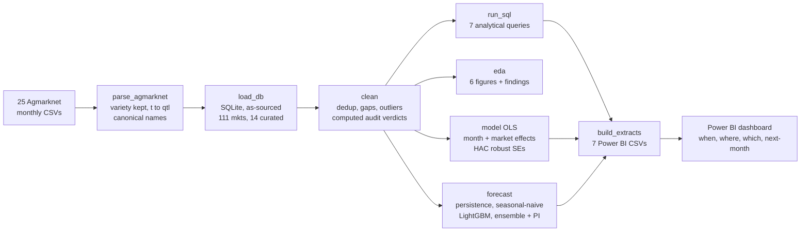

# Mandi Price Watch — When, Where, and Which Onion Should Maharashtra's Farmers Sell?

An analysis of **31,930 daily onion price records** from **111 Maharashtra mandis**
(Jun 2024 – Jun 2026, real [Agmarknet](https://agmarknet.gov.in) data), turning
India's public agricultural price data into three things a DeHaat field agent can
carry to a farmer:

1. **When** to sell — the seasonal window.
2. **Where** to sell — the market premium.
3. **Which** onion variety pays best — and **what next month's price will be**, per market.

**Dashboard:** [add your public Power BI link here]
**Walkthrough:** [add your video link here]

---

## The question

DeHaat's advisory team supports farmer producer organisations whose members ask
the same questions every season: **when should we sell, in which market, and
which type of onion earns the most — and what happens to the price next month?**

## The answers

### 1. Timing is worth about twice what market choice is worth

| Decision | Worth to the farmer |
|---|---|
| Selling in **November** rather than **May** | **₹1,503/quintal** (a 2.5× swing) |
| Selling in **Lasalgaon** rather than **Chh. Sambhajinagar** | **₹756/quintal** (before transport) |
| Selling **Red** onion rather than **Local** | **₹530/quintal** (a grade/variety premium) |

Onion prices across the curated markets **peak in September–November** (index
140–144) and **trough in April–May** (index 57–58). July is a secondary high.
The seasonal shape is shared across markets; only the price level differs.

### 2. Where: the Nashik onion belt pays the most

Lasalgaon (Asia's largest onion market and the reference-price setter) and the
neighbouring Pimpalgaon/Vinchur markets sit **12–16% above the state average**;
Chhatrapati Sambhajinagar sits **27% below**. The spread is a **gross** figure —
transport cost is not in this data and must be netted off before advising travel.

### 3. Which variety: Red onion commands a clear premium

**Red ₹2,231/qtl**, against **Local ₹1,701** and **Unhali ₹1,328**. A farmer
growing Red realises roughly **31% more** than one growing Local, independent of
timing and market.

### 4. Next month: a per-market price forecast

A monthly, per-mandi forecaster predicts next month's price with a **₹168/quintal
(13.9%) mean error** in walk-forward backtesting. For **July 2026** it ranks
**Pimpalgaon Baswant** highest at **₹1,788/quintal** (range ₹1,555–1,884). The
dashboard shows the full ranking with an uncertainty band on every market.

## The honest part

**A single mandi's own daily arrivals barely predict its price** (pooled r ≈
−0.03). Onion price at a market is set by state/national supply and the reference
market, not by that day's local truck count — so arrivals earns only a minor
role, and the seasonal and market-level effects do the real work.

**The forecaster does not beat a naive "next month ≈ this month" baseline by
much** (₹168 vs ₹169 MAE). Monthly onion prices are close to a random walk with
unpredictable shocks. The hybrid model matches the baseline on accuracy **and
adds a calibrated uncertainty band** — but it cannot foresee a supply shock, and
this dataset contains no weather, MSP, or export-policy data that would let any
model do so. The two 2024–25 shock periods (prices to ₹25,000/qtl) are exactly
where every model is weakest, and the error runs one way: **the real peak will be
higher than predicted, never lower.**

---

## Data

| | |
|---|---|
| Source | Agmarknet (Government of India), 25 monthly exports |
| Commodity | Onion (varieties: Red, Local, White, Unhali, + Other) |
| Geography | 111 mandis loaded; **14 curated** high-coverage markets for recommendations |
| Period | Jun 2024 – Jun 2026 (24 months; **Aug 2024 absent from the source**) |
| Records | 31,930 variety-day rows → 8,114 curated mandi-days |
| Price measure | Modal price (₹/quintal); arrivals converted tonnes → quintals |

Modal price was chosen over min/max because it is the price at which the largest
volume actually traded — what a typical farmer with a typical lot receives.

## Approach



1. **Assemble** — 25 exports parsed (market headers walked line-by-line, varieties
   kept, arrivals converted to quintals) → SQLite, two tables, as-sourced.
2. **Clean** — duplicates, gaps, outliers, units; every verdict **computed** from a
   statistic and a threshold, logged to `outputs/cleaning_audit.json`.
3. **Explore** — six figures, each establishing one claim
   ([`outputs/eda_findings.md`](outputs/eda_findings.md)).
4. **Explain** — one OLS on month + market (with HAC robust standard errors) for
   the interpretable "why", plus a per-variety and per-market seasonal breakdown.
5. **Forecast** — a monthly per-mandi model: persistence and seasonal-naive
   baselines, a LightGBM lag-feature model, and a hybrid ensemble with quantile
   prediction intervals, all evaluated walk-forward
   ([`notebooks/model_card.md`](notebooks/model_card.md)).
6. **Communicate** — a Power BI dashboard and a one-page decision memo.

## Repository

```
data/
  01_source/     immutable Agmarknet exports (25 CSVs)
  02_interim/    parsed flat tables + coverage
  03_processed/  SQLite db + cleaned CSVs
sql/             schema + 7 analytical queries (incl. variety)
src/             parse -> load -> clean -> sql -> eda -> model -> forecast -> extracts
  run_pipeline.py   one command runs it all
tests/           pytest suite (parser, cleaning, forecaster leakage)
notebooks/       reconciliation log, data quality note, feature spec, model card
outputs/         query results, 12 figures, model + forecast artefacts
dashboard/       7 Power BI extracts + build guide
memo/            one-page decision memo (MD + PDF)
ai_appendix/     prompt log and judgment note
```

## Reproducing

```bash
pip install -r requirements.txt
cd src
python run_pipeline.py        # parse -> load -> clean -> sql -> eda -> model -> forecast -> extracts
python -m pytest ../tests -q  # run the test suite
```

The full pipeline runs end-to-end in about 20 seconds and regenerates every
figure, table, and JSON from the raw exports. Scope is controlled entirely by
`src/config.py`: changing the commodity, state, curated market list, or date
range requires editing that file only — no query or script hardcodes a mandi, a
commodity, or a price column.

## Limitations

1. **24 months means each calendar month is observed only ~2 times**, and **August
   2024 is missing entirely** — the seasonal peak rests on few observations. *The
   single largest caveat.*
2. **No weather, MSP, or export-policy data** — the causes of the price shocks the
   forecaster cannot anticipate.
3. **Missingness is mildly non-random** (driven partly by the August 2024 gap);
   aggregates therefore carry observation counts so thin cells stay visible.
4. **Market premiums are gross of transport cost**, which is not in this dataset.
5. **The forecast is monthly and short-horizon** — it answers "next month, per
   market", not "next week", and it cannot predict a supply shock.
6. **Recommendations assume storage is available**; for farmers who cannot hold
   stock, timing advice is not actionable.
